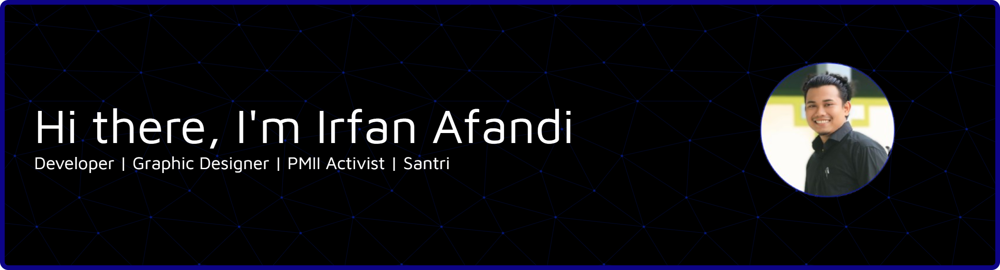

### Hi there I'm Irfan Afandi 👋

###### 🌐 Socials:

   

<h2 data-importer="text" align="left">I code with</h2>

###

  
  
  
  
  
  
  
  
  
  
  
  
  
  
  
  
  
  
  
  
  
  
  
  
  
  
  
  
  
  
  
  
  
  
  
  
  

###

Play games with me

###

###

<picture data-importer="pacman">
  <source media="(prefers-color-scheme: dark)" srcset="https://raw.githubusercontent.com/Mlana198/Mlana198/pacman-output/pacman-contribution-graph-dark.svg?game=pacman">
  <source media="(prefers-color-scheme: light)" srcset="https://raw.githubusercontent.com/Mlana198/Mlana198/pacman-output/pacman-contribution-graph.svg?game=pacman">
  
</picture>

###

##### ✍️ Random Dev Quote

##### 🔝 Top Contributed Repo

---

<!-- Proudly created with GPRM ( https://gprm.itsvg.in ) -->

<!-- Proudly created with GPRM ( https://gprm.itsvg.in ) -->

<!--

- 🌱 I’m currently learning **Laravel** & **Filament** Framework

#### Skills

#### Connect With Me

    -->
